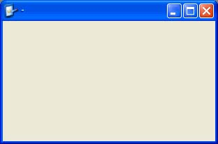



## xp style

### Description

i did some changes to the code but the credit is to douglass sheffer. is his code not asking for votes or anything. i am working on xp style controls as well and custom basic controls. in c++ as well as vb. if you like let me know.

the original code is at http://planetsourcecode.com/vb/scripts/ShowCode.asp?txtCodeId=30137&lngWId=1
 
### More Info
 
you need to set the form borderstyle=0

and you need to set the form showintaskbar=true

Private Sub Titlebar1_Closed()

End

End Sub

Private Sub Titlebar1_Maximized()

Me.WindowState = 2

End Sub

Private Sub Titlebar1_Minimized()

Me.WindowState = 1

End Sub

Private Sub Titlebar1_Normal()

Me.WindowState = 0

End Sub

Private Sub Form_Resize()

Titlebar1.Height = Me.Height

Titlebar1.Width = Me.Width

Titlebar1.Top = 0

Titlebar1.Left = 0

End Sub

             |
---                |---
**Submitted On**   |2002-08-01 20:42:12
**By**             |[cpsim](https://github.com/Planet-Source-Code/PSCIndex/blob/master/ByAuthor/cpsim.md)
**Level**          |Intermediate
**User Rating**    |3.0 (15 globes from 5 users)
**Compatibility**  |VB 6\.0
**Category**       |[Custom Controls/ Forms/  Menus](https://github.com/Planet-Source-Code/PSCIndex/blob/master/ByCategory/custom-controls-forms-menus__1-4.md)
**World**          |[Visual Basic](https://github.com/Planet-Source-Code/PSCIndex/blob/master/ByWorld/visual-basic.md)
**Archive File**   |[xp\_style113406812002\.zip](https://github.com/Planet-Source-Code/cpsim-xp-style__1-37522/archive/master.zip)

